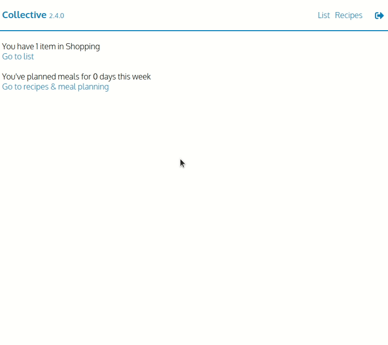

# Collective

Collective is an application for households to share their shopping list and recipes in real-time.

## Features

- Add items to your shopping list that synchronise instantly across devices and users (both mobile and web).
- Previously added items are returned to their original category.
- Store recipes, their ingredients and plan your meals for the week.
- Collective is a Progressive Web Application (PWA) - install it and it can function entirely offline.

  

## Development

### Architecture

Collective follows a vertical architecture:

- The application is divided into functional areas, with each of these containing their associated models, components and hooks.
- CSS modules are used for styling.
- Tests are co-located and follow the `*.test.ts[x]` pattern.

### Technologies

Collective is a `React` application written in `TypeScript`, backed by a Google Firestore database and hosted using Goole App Engine.
In addition a number of firebase functions are used for operations that should not happen client-side.

Jest and React Testing Library are used for automated testing, and tests are run automatically using a Circle CI pipeline.

### Deployment

First time setup:

1. First time setup only - install the [google cloud SDK](https://cloud.google.com/sdk/docs/install) and initialise the environment by running `gcloud init`, selecting the relevant appengine project
2. Create a production build by running `npm run build`
3. Run `gcloud app deploy --version MAJOR-MINOR-PATCH`
